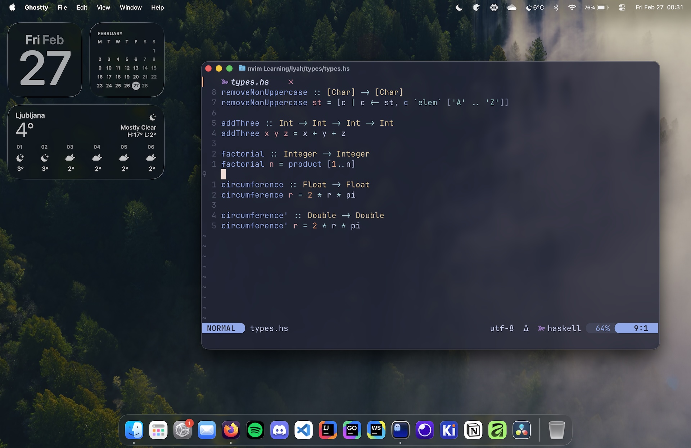

# My (minimalist) MacOS dotfiles

## Programs
- **Editor:** NeoVim (VSCode/JetBrains IDEs for web etc.)
- **Terminal emulator:** Ghostty
- **Shell:** ZSH
- **Prompt:** Starship

## NeoVim keybinds
I use space as my leader, and I have my right Option key set to Alt (set in Ghostty).

**Note:** I also have the default `mini-completion` keybinds that are not mentioned in the table.

| Bind | Action | Mode |
|------|--------|------|
|Esc+Esc|:noh| n |
|Space+t|Toggle NvimTree| n |
|Space+n|New buffer|n|
|Space+k|Close buffer|n|
|Tab|Cycle Bufferline to the right|n|
|Shift+Tab|Cycle Bufferline to the left|n|
|Space+f+f|LSP file format|n|